# My-Safari-Knowledge-Quiz

When I think of animals, I think of a Safari or Outback. Animals can entertain people in so many ways. We got the zoo to see them, we read about them on the internet or books to learn more about them. Now would you say you know your animals? Safari Knowledge Quiz is created to test how well children, under the age of 5, know their animals. This game hopes to entertain children when they want to know more about their animals. 

## Features 

### Username
- This feature requires a player to add their name before playing.
- A player is however not required to have their name inserted.
- Once a name is inserted, a pop up will apear alerting the user to start playing the game. Please see image below:

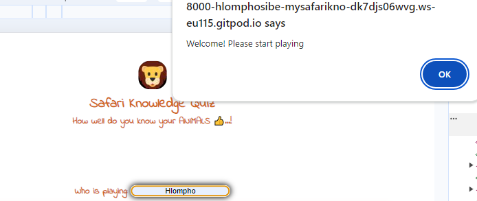

### Playground
- The playground shows a question and an image.
- A question and image would appear on the playground when game is running.
- I used a white background so the animal images can pop.
- The image's role here is to help the player know which animal is being referred to. Please see below image:

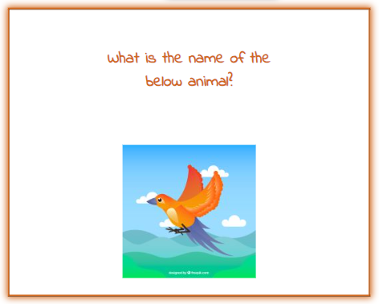

### Answer Options Area
- This feature is used to restrict a player from giving answers which are not in the game. Some questions have a number of ways to answer, so with the given options, a player will be limited.
- It consists of radio buttons where a player will select the correct answer to win the game. Please see below image:

### Score Area
- Once the player has has submitted their answer, this feature will then show if the answer is correct or not.
- The correct answer number will increase everytime a player gets correct answers.
- The wrong answer number will also increase everytime a player is wrong.
- At the end of the game, a player will then see how they did. Please see image below:

### Game Over and Reload Button
- When a user has reached the end of the game, a GAME OVER screen will appear.
- This screen will also show the player's score.
- The reload button appears same time with the GAME OVER screen.
- Once a level has been completed, then the reload button will be clicked to restart the game.

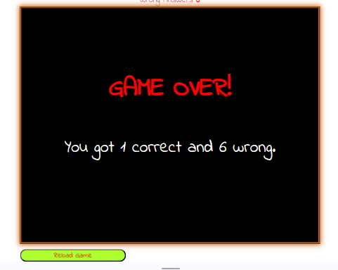

### Features Left to implement
* Add more questions and animal images to the game to make it more interesting.
* Make the username visible when the user is playing again.

## Testing
### Manual Testing
* Before, one of my images was overlapping from the playground area. Please see image below:

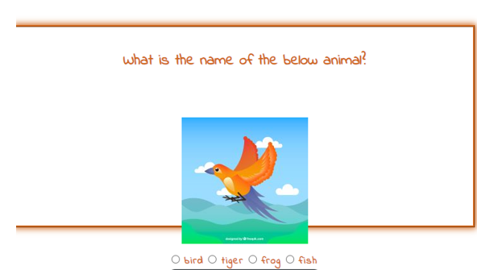

* After carefully resizing the images, they all fit inside the playground. Please see image below:

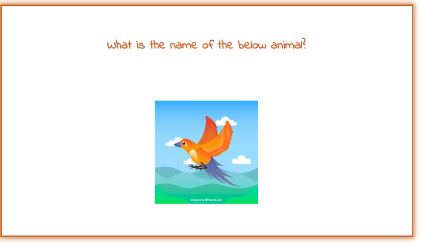

### Validator Testing

##### HTML
* Errors
    - Four errors were found on HTML.
    - 1. I did not include spaces between attributes. 
      2. Inside the username input element, I put two types of values in one input element.
      3. I did not add the alt attribute inside the img element.
      4. The value of the for attribute should be the same as the ID of the input element. Please see image below:

    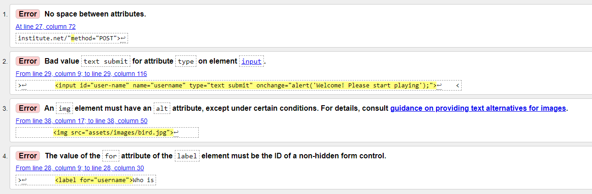

    - After carefully reviewing the HTML code, there appears to be no more errors. [Validator W3 html](https://validator.w3.org/nu/#textarea)
    - Please see screenprint below:

    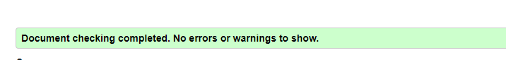

##### CSS
   - There appears to be no errors with CSS code. [Validator W3 css](https://jigsaw.w3.org/css-validator/validator)
   - However, there are four warnings referring to the background color used for the username input area. Please see below:
   
   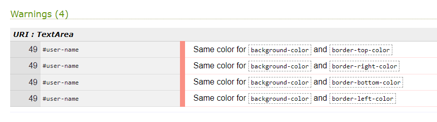

   - After changing the background color of username input area, the warnings disappeared. Please see screenprint:

   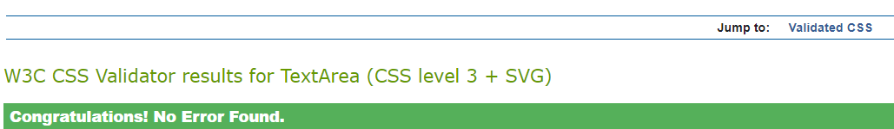
    
##### JavaScript
   - No errors were detected on the JavaScript code, only 40 warnings.
   - A variable on the code was unused which caused a warning.
   - Undefined variables also caused a warning.
   - Some areas in the code did not have semi colons. Please see below screenprints:

   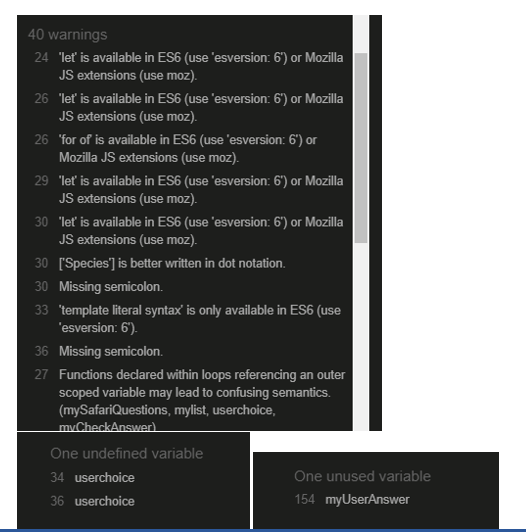   

   - There are only 18 warnings remaining, referring to the JavaScript variables and their syntax. [JavaScript validator](https://jshint.com/)
   - Please see screen print below:

   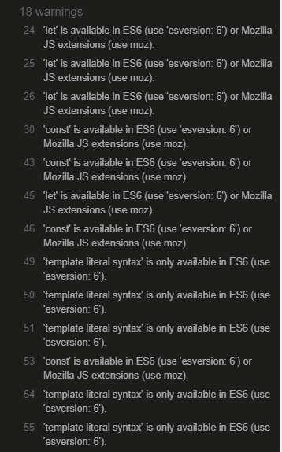 

##### Lighthouse

   - My Safari Knowledge Quiz could not pass all lighthouse results
   - Looks like images are large
   - If the size of the images is reduced, they are going to be too small. Please see image below:

   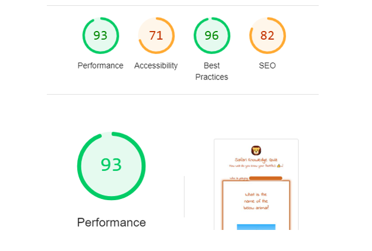

   - The size of the images was causing the errors.
   - Img elements did not include 'alt' attribute which was also causing the error. Please see screenprint below:
   
   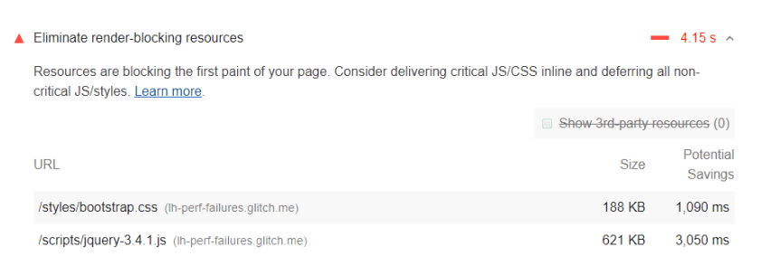
   
   There appears to be no errors. Please see screen below:

   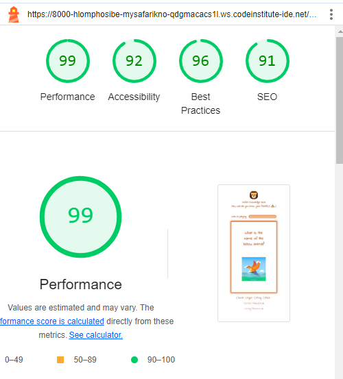

#### Unresolved Bugs
* The warnings referring to the JavaScript code are unresolved due to the version of site used to validate code.
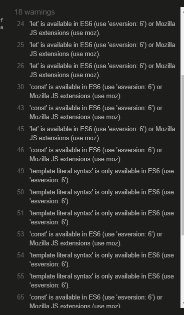

## Deployment
* This site was deployed to GitHub pages. The steps are as follows:
    - In the GitHub repository, navigate to the Settings tab
    - Under General section, select Pages
    - From the source section, click drop down to select Deploy from branch 
    - Under Branch, select main, file/root and save  
    - Once the save button is clicked, wait a couple of minutes to refresh the page
    - After refreshing, the code page will appear and show that deployment was successful.

The live link can be found here - https://hlomphosibeko.github.io/Safari-Knowledge-Quiz/

## Credits
### Content
* The JS code used to group the questions, question images and answers is taken from [YouTube](https://www.youtube.com/channel/UCEsOe19aGFcM31zLG2M2sXw)
* A tutor, Roman, advised that I don't replace radio button elements, but change values in the radio buttons.
* Tom, a tutor, helped with overlapping images.
* Roman, a tutor, helped with the looping of the game.
* Sean, a tutor, help with the error referring to an undefined variable which was interrupting the flow of the game. 
* To position my playground, I used a code from Love Maths Walkthrough Project conducted by Anna Greeves.
* For an overview of JavaScript and a better understanding of how a DOM functions, I used [Udemy](https://www.udemy.com/course/mega-web-development-course-fullstack-javascript-python-django-backend/learn/lecture/34745556#overview)
* Looping on radio buttons and functionalities around the looping system, I used [W3Schools](https://www.w3schools.com/js/js_loop_for.asp)
* How a multiple choice game is created, I used [Web-Dev-Simplified](https://www.youtube.com/watch?v=riDzcEQbX6k)

### Media
* The images used on this game are taken from [Freepik](https://www.freepik.com/free-photos-vectors/safari-animals/)
* The thumb emoji used at the top of the game is taken from [Emojipedia](https://emojipeadia.org/thums-up)
