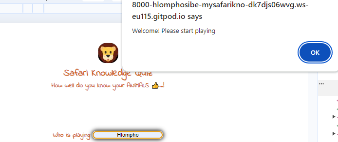
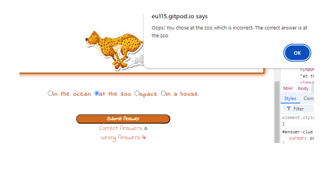
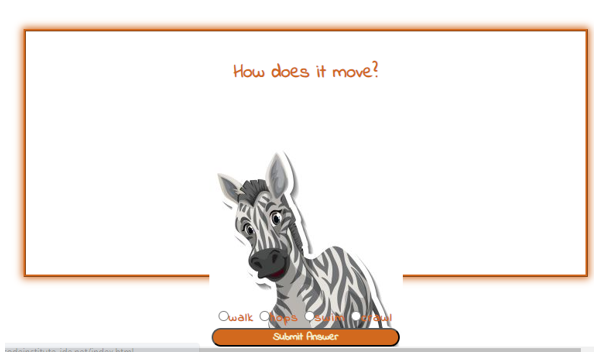
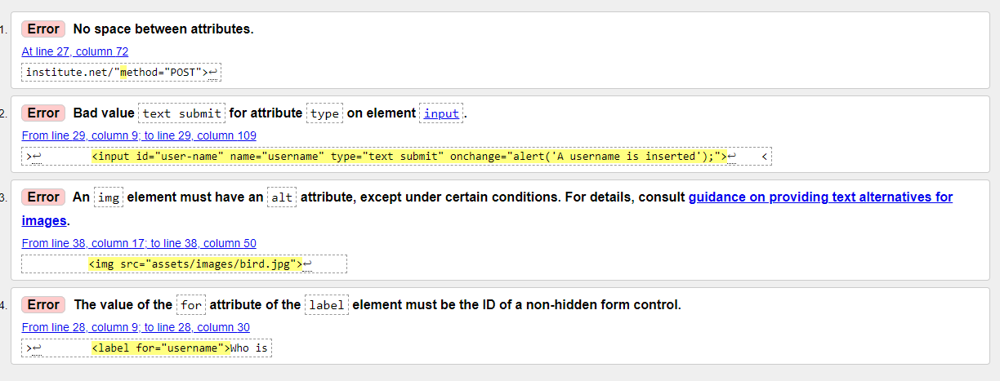

# My-Safari-Knowledge-Quiz

Animals can entertain people in so many ways. We got the zoo to see them, we read about them on the internet or books to learn more about them. Now would you say you know your animals? Safari Knowledge Quiz is created to test how well children, under the age of 5, know their animals. This game hopes to entertain children when they want to know more about their animals. 

## Features 

### Username
- This feature requires a player to add their name before playing.
- A player is however not required to have their name inserted.
- Once a name is inserted, a pop up will apear alerting the user to start playing the game. Please see image below:

### Playground
- The playground shows a question and an image.
- A question and image would appear on the playground when game is running.
- The image's role here is to help the player know which animal is being referred to. Please see below image:

### Answer Options Area
- This feature is used to restrict a player from giving answers which are not in the game. Some questions have a number of ways to answer, so with the given options, a player will be limited.
- It consists of radio buttons where a player will select the correct answer to win the game. Please see below image:

### Score Area
- Once the player has has submitted their answer, this feature will then show if the answer is correct or not.
- The correct answer number will increase everytime a player gets correct answers.
- The wrong answer number will also increase everytime a player is wrong.
- At the end of the game, a player will then see how they did. Please see image below:

### Game Over and Reload Button
- When a user has reached the end of the game, a GAME OVER screen will appear.
- This screen will also show the player's score.
- The reload button appears same time with the GAME OVER screen.
- Once a level has been completed, then the reload button will be clicked to restart the game.

### Features Left to implement
* Add more questions and animal images to the game to make it more interesting.
* Make the username visible when the user is playing again.

## Testing
### Manual Testing

#### My Playground
* I wanted to add  keyboard to the game. My mentor advised that I remove it as all devices already have a keyboard. Please see below image:

* The game is not looping
* When selecting the right answer, the alert for the incorrect answer pops up. Please see image below:

* Some images are too big for the playground, they are overlapping.

### Validator Testing

*HTML
##### Errors
    - 
    

## Deployment
* This site was deployed to GitHub pages. The steps are as follows:
    - In the GitHub repository, navigate to the Settings tab
    - Under General section, select Pages
    - From the source section, click drop down to select Deploy from branch 
    - Under Branch, select main, file/root and save  
    - Once the save button is clicked, wait a couple of minutes to refresh the page
    - After refreshing, the code page will appear and show that deployment was successful.

The live link can be found here - https://hlomphosibeko.github.io/Safari-Knowledge-Quiz/

## Credits
### Content
* The JS code used to group the questions, quesion images and answers is taken from [YouTube](https://www.youtube.com/channel/UCEsOe19aGFcM31zLG2M2sXw)
* A tutor, Roman, advised that I don't replace radio button elements, but change values in the radio buttons.

### Media
* The images used on this game are taken from [Freepik](https://www.freepik.com/free-photos-vectors/safari-animals/)
* The thumb emoji used at the top of the game is taken from [Emojipedia](https://emojipeadia.org/thums-up)